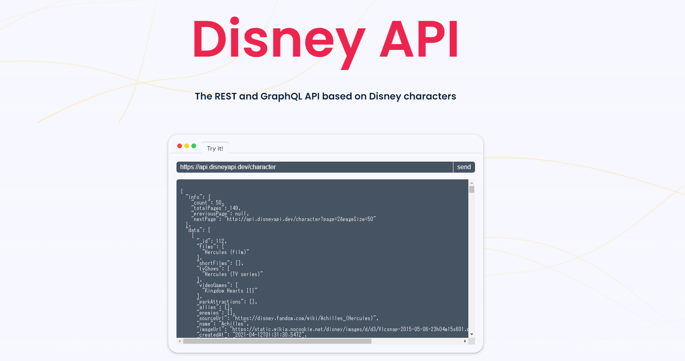

<!-- _class: top -->

# REST API ソロプロジェクト

---

## はじめに

- ディズニーのキャラクター情報をCRUDするAPIを作成しました。
- 本資料では下記の内容について紹介します。
  - データの説明
  - CRUD APIの仕様
  - Github Actions(おまけ)
  - marp-cli(おまけ)

---

### データの説明

データは[Disney API](https://disneyapi.dev/)の[キャラクター情報取得API](https://api.disneyapi.dev/character)から取得した情報を利用しました。


---

Disney APIのレスポンスの中に複数のリストが含まれており、このままではRDBに入れることができない(第1正規系でない)ため、加工を行いました。

```js
{
  "info": {
    "count": 50,
    "totalPages": 149,
    "previousPage": null,
    "nextPage": "http://api.disneyapi.dev/character?page=2&pageSize=50"
  },
  "data": [
    {
      "_id": 112,
      "films": [
        "Hercules (film)"
      ],
      "shortFilms": [],
      "tvShows": [
        "Hercules (TV series)"
      ],
      "videoGames": [
        "Kingdom Hearts III"
      ],
      "parkAttractions": [],
      "allies": [],
      "enemies": [],
      "sourceUrl": "https://disney.fandom.com/wiki/Achilles_(Hercules)",
      "name": "Achilles",
      "imageUrl": "https://static.wikia.nocookie.net/disney/images/d/d3/Vlcsnap-2015-05-06-23h04m15s601.png",
      "createdAt": "2021-04-12T01:31:30.547Z",
      "updatedAt": "2021-12-20T20:39:18.033Z",
      "url": "https://api.disneyapi.dev/characters/112",
      "__v": 0
    },
    ...
  ]
}
```

---

### データの加工

`processing.js`を作成し、データの加工を行って各リストをテーブルに切り出しました。

```js
const film = [];
data.forEach((row) => {
  row.films.forEach((innerrow) => {
    film.push({ charactor_id: row._id, name: innerrow });
  });
});
fs.writeFileSync(
  __dirname + "\\..\\data\\film.json",
  JSON.stringify({ data: film })
);
```

---

最終的なデータ形式は下記のような形になっています。(正規化されていないのですが時間の都合上できませんでした、、)

```js
{
  "data": [
    { "charactor_id": 112, "name": "Hercules (film)" },
    { "charactor_id": 18, "name": "The Fox and the Hound" },
    { "charactor_id": 18, "name": "The Fox and the Hound 2" },
    { "charactor_id": 16, "name": "Cheetah" },
    { "charactor_id": 45, "name": "Mary Poppins (film)" },
    { "charactor_id": 45, "name": "Mary Poppins Returns" },
    { "charactor_id": 139, "name": "The Lion King" },
    { "charactor_id": 139, "name": "The Lion King (2019 film)" },
    { "charactor_id": 204, "name": "The Robber Kitten" },
    { "charactor_id": 204, "name": "Mickey's Polo Team" },
    ...
  ]
}
```

---

テーブルの構造は下記のようになっています。


---

## API仕様 & デモ

以下のAPIを作成しました。APIの仕様の説明とデモを行います。

- キャラクター情報全件取得API
- キャラクターID指定取得API
- キャラクター情報作成API
- キャラクター情報更新API
- キャラクター情報削除API

---

### 1. キャラクター全件取得API

- GET /api/charactors
- クエリパラメータ: limit={取得数}
- レスポンスボディ

```
[
  {
    id: 112,
    films: ["Hercules (film)"],
    shortFilms: [],
    tvShows: ["Hercules (TV series)"],
    videoGames: ["Kingdom Hearts III"],
    parkAttractions: [],
    allies: [],
    enemies: [],
    sourceUrl: "https://disney.fandom.com/wiki/Achilles_(Hercules)",
    name: "Achilles",
    imageUrl:
      "https://static.wikia.nocookie.net/disney/images/d/d3/Vlcsnap-2015-05-06-23h04m15s601.png",
  }
]
```

---

### 2. キャラクターID指定取得API

- GET /api/charactors/:id
- パスパラメータ: id={キャラクターID}
- レスポンスボディ

```
[
  {
    id: 112,
    films: ["Hercules (film)"],
    shortFilms: [],
    tvShows: ["Hercules (TV series)"],
    videoGames: ["Kingdom Hearts III"],
    parkAttractions: [],
    allies: [],
    enemies: [],
    sourceUrl: "https://disney.fandom.com/wiki/Achilles_(Hercules)",
    name: "Achilles",
    imageUrl:
          "https://static.wikia.nocookie.net/disney/images/d/d3/Vlcsnap-2015-05-06-23h04m15s601.png",
  }
]
```

---

### 3. キャラクター作成API

- POST /api/charactors
- リクエストボディ

```
{
  id: 99999,
  films: ["Hercules (film)"],
  shortFilms: [],
  tvShows: ["Hercules (TV series)"],
  videoGames: ["Kingdom Hearts III"],
  parkAttractions: [],
  allies: [],
  enemies: [],
  sourceUrl: "https://disney.fandom.com/wiki/Achilles_(Hercules)",
  name: "Achilles",
  imageUrl:
    "https://static.wikia.nocookie.net/disney/images/d/d3/Vlcsnap-2015-05-06-23h04m15s601.png",
}
```

- レスポンスボディ

```
なし
```

---

### 4. キャラクター削除API

- DELETE /api/charactors/:id
- パスパラメータ: id={キャラクターID}
- リクエストボディ

```
なし
```

---

### 5. キャラクター更新API

- PATCH　/api/charactors
- リクエストボディ

```
{
  id: 99999, // 必須
  sourceUrl: "https://disney.fandom.com/wiki/Achilles_(Hercules)",
  name: "Achilles",
  imageUrl:
    "https://static.wikia.nocookie.net/disney/images/d/d3/Vlcsnap-2015-05-06-23h04m15s601.png",
}
```

- レスポンスボディ

```
なし
```

---

## 感想

- 1からNode, ExpressでAPIを作成する経験ができて勉強になった。
- 複数テーブル跨いだりトランザクションを利用することに慣れておらず時間がかかった。knexに習熟したい。
